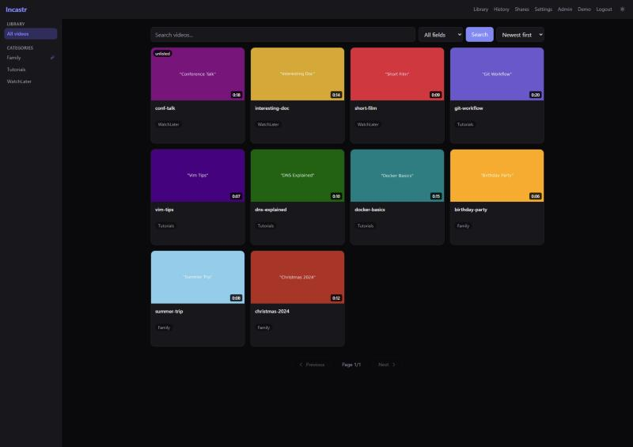
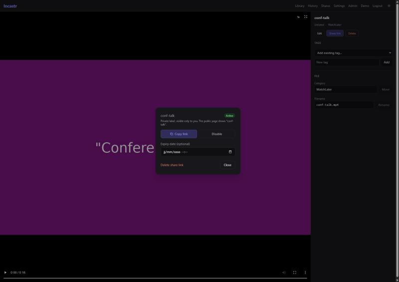
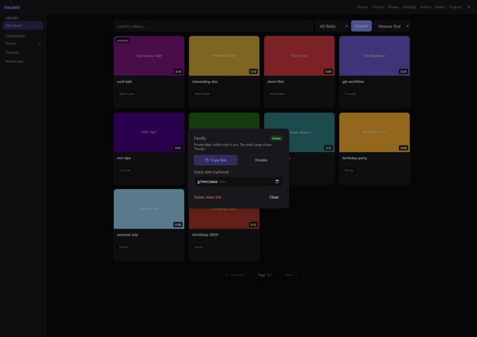

# Incastr

A self-hosted video library that stays out of your way.



---

> ⚠️ **Security notice**
>
> This application was built with AI assistance and is designed for local or trusted-network use. Exposing it to the public internet without an additional access-control layer (reverse proxy with auth, VPN, etc.) is done at your own risk.

---

## The problem

You've got a folder full of videos: family recordings, trip footage, tutorials you've saved, a little knowledge base you've been building. They're already organised the way you want them. But browsing them means opening a file manager, squinting at filenames, and digging through nested folders to find that one video.

You've probably looked at Plex or Jellyfin. They're great pieces of software, for a different use case. They're built for media libraries that need metadata scraped from the internet, posters fetched, agents configured, databases maintained. That's a lot of infrastructure for a collection of MP4s you already know how to organise. And the moment you try to share something, you're back to sending a 2 GB file attachment that crashes in someone's inbox.

Incastr is the other thing. No metadata fetching, no transcoding service to keep running, no agents. You point it at a folder, it scans the files, and they appear in a clean browsable interface, with thumbnails, tags, and search. That's it.

---

## How it works

**Your folder structure is your organisation.**

```
/media/videos/
├── Family/
│   ├── summer-2023.mp4
│   └── christmas.mkv
├── Tutorials/
│   ├── docker-basics.mp4
│   └── networking/
│       └── dns-explained.mp4
└── WatchLater/
    └── interesting-talk.mp4
```

Mount that folder, point Incastr at it, run a scan. You get three categories: **Family**, **Tutorials**, **WatchLater**. No configuration, no metadata to fill in. Incastr always uses the first-level subfolder as the category name; deeper nesting is fine, a video at `Tutorials/networking/dns-explained.mp4` still lands in **Tutorials**.

Need to move a video to a different category? Rename a file? You can do all of that from the interface, and it moves the actual file on disk.

Picked up a video partway through? Incastr remembers where you stopped and offers to resume next time you open it.

---

## Sharing without the pain

Sending a raw video file is terrible. It's too large for email, awkward in messaging apps, and requires the other person to download the whole thing before watching anything.

With Incastr you get two kinds of shareable links, no account needed on the recipient's end:

**Single video.** Click Share on any video. Incastr switches it to *Unlisted* and gives you a link. Anyone with the URL can watch it directly in their browser.



**Whole category.** Click the share icon next to any category in your library. Incastr generates a private link to the entire category, showing everyone a clean grid of the videos inside it.



Every share, video or category, can be given a private label so you can tell them apart at a glance, paused and resumed, given an expiry date, or revoked outright. That label is for you only: visitors always see the video's real title or the category's real name, never your internal note. A dedicated **Shares** page lists every active link in one place for managing them later, but you can also name a link the moment you create it, right from the share dialog.

---

## Features

- **Thumbnails** generated automatically by ffmpeg during scan, no manual work
- **Categories** from your folder names, zero setup required
- **Tags** for fine-grained labels on individual videos
- **Full-text search** across title, description, category, and tags
- **Watch history** with resume, so you can pick up where you left off
- **File management**: rename files, move them to a different category, delete from disk, all from the browser
- **Duplicate detection** to spot the same file sitting in two places
- **Multi-user**, each with their own library, folders, and shares
- **Admin panel** for managing accounts on shared instances
- **Public landing page**, optionally showing some videos to anyone who visits your instance
- **Dark and light themes**, following your system preference or your own choice
- **Pagination** with a clear page count, 16 videos per page

---

## Quick start

**1. Get the compose file**

```bash
git clone https://github.com/tiritibambix/incastr.git
cd incastr
```

**2. Edit `docker-compose.yml`**

```yaml
volumes:
  - /path/to/your/videos:/media/videos  # remove :ro if you want to delete/move files from the browser

environment:
  - SECRET_KEY=change-this-to-something-long-and-random
  - MEDIA_DIR=/media/videos   # auto-registers this folder for your admin account on first boot
```

**3. Start**

```bash
docker compose up -d
```

Open `http://your-server:8420`, create your account (the first user is automatically an admin), then hit **Scan all** in Settings. Your videos appear within seconds.

---

## Configuration

| Variable | Default | Description |
|---|---|---|
| `SECRET_KEY` | **required** | JWT signing key, use a long random string in production |
| `MEDIA_DIR` | none | Path to auto-register as a video folder for your primary admin account (the earliest one created) on every startup, if not already registered |
| `THUMBS_DIR` | `/data/thumbs` | Where thumbnails are stored |
| `SCAN_INTERVAL_MINUTES` | `60` | How often to auto-scan for new files (`0` disables it) |
| `ALLOW_REGISTRATION` | `true` | Set to `false` to lock down new sign-ups |
| `ACCESS_TOKEN_EXPIRE_MINUTES` | `60` | Login session length |
| `MAX_SCAN_DEPTH` | `10` | How deep to recurse into subfolders |
| `FIRST_ADMIN_USERNAME` | none | Create an admin account on first startup (headless / CI setup) |
| `FIRST_ADMIN_PASSWORD` | none | Used alongside the above |
| `FIRST_ADMIN_EMAIL` | none | Used alongside the above |

---

## Supported formats

Incastr serves files directly, no transcoding, no re-encoding. Supported container formats:

`.mp4` `.mkv` `.avi` `.mov` `.webm` `.m4v` `.ts` `.flv` `.wmv` `.mpg` `.mpeg` `.m2ts` `.mts`

**H.264/MP4 plays in every browser without any issues.** MKV and HEVC work if your browser's codec support covers them. If a file doesn't play, re-encoding to H.264/AAC in an MP4 container is the reliable fix.

---

## Deployment

Incastr runs on port `8420` by default. Behind Nginx Proxy Manager or any other reverse proxy, just point it at that port and enable HTTPS, no special configuration needed on Incastr's side.

It runs fine on modest hardware. A Raspberry Pi or a cheap VPS handles a personal collection without breaking a sweat. SQLite keeps the footprint small, no external database to manage.

---

## Development

```bash
# Backend (Python 3.12+)
pip install -r requirements.txt
uvicorn backend.main:app --reload

# Frontend
cd frontend
npm install
npm run dev   # proxies /api to localhost:8000
```

---

## Tech

- **Backend**: Python 3.12, FastAPI, SQLAlchemy (async), SQLite, Alembic, ffmpeg
- **Frontend**: React 18, TypeScript, Vite, Tailwind CSS
- **Container**: single Docker image, multi-stage build

---

## License

MIT
